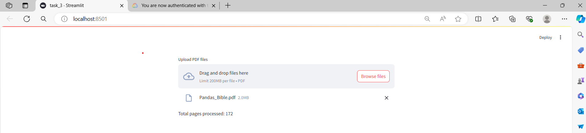
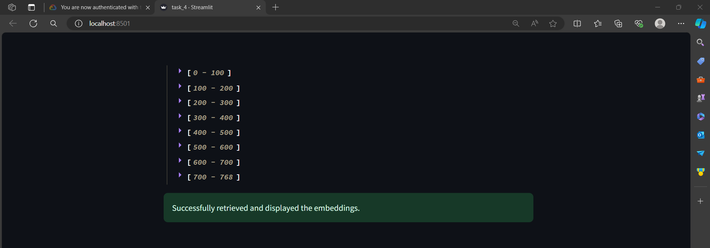
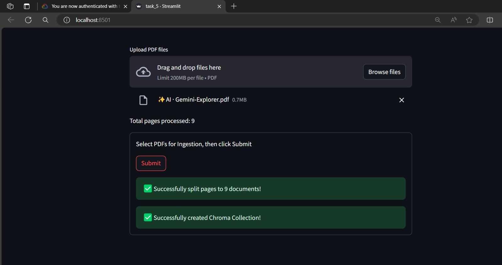
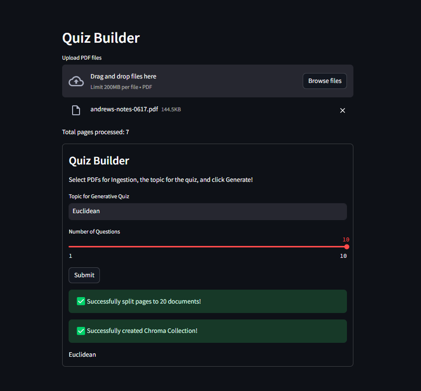
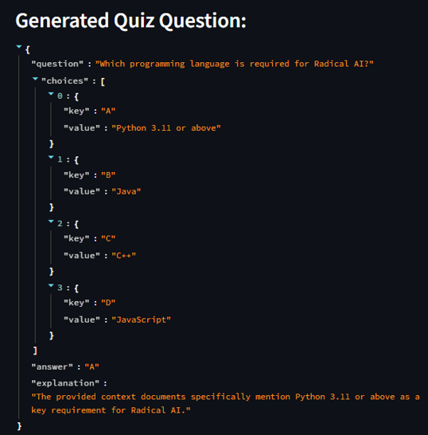
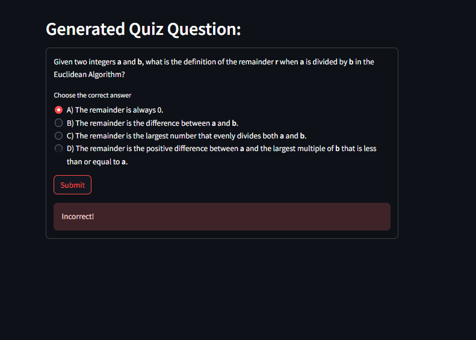
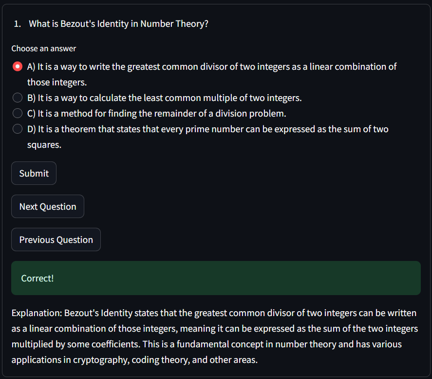

# Quizzify

## Overview

Gemini Quizzify is an innovative tool designed to enhance the learning experience by providing a platform for generating custom quizzes. This application leverages advanced AI technologies to read user-uploaded documents, deliver instant feedback, and dynamically create quizzes with multiple-choice questions, complete with answer keys and explanations.

## Demo Video
https://github.com/user-attachments/assets/f99c75d4-4e96-40a9-9bf5-abb06221e7a4

## Detailed Tasks
* Task 1: Configuring Google Cloud, Vertex AI, & SDK Authentication.
* Task 2: Setting Up the Development Environment
* Task 3: Ingesting Documents
* Task 4: Embedding Text with Vertex AI & Langchain
* Task 5: Building the Data Pipeline to Chroma DB
* Task 6: Creating the Streamlit UI for Data Ingestion
* Task 7: Developing the Quiz Generator Class
* Task 8: Implementing the Quiz Generation Algorithm
* Task 9: Building the Quiz User Interface
* Task 10: Handling Screen States

## Task 1: Configuring Google Cloud, Vertex AI, & SDK Authentication.
### Set Up Google Cloud Project:
- Create a new project in Google Cloud Console named <i>Gemini Quizify</i>.
- Navigate to the `Vertex AI` section and `enable all recommended APIs`.

### Service Accounts:
- Create a new service account in the Service Accounts section.
- Assign the service account the `Owner` role for full access permissions.
- Download the service account authentication key in `JSON` format.

### Authentication Configuration:
- Save the JSON authentication key file in your project directory.
- Update your `.gitignore` file to exclude the authentication key file for security.
- Set the environment variable to point to the authentication key file

```sh
export GOOGLE_APPLICATION_CREDENTIALS = "/path/to/your/authentication-file.json"
```

## Task 2: Setting Up the Development Environment
* **build a virtual environment (optional but highly recommended)**
    - remember to update .gitignore to ignore the environment folder
```sh
python3 -m venv env
```
```sh
source env/bin/activate
```
- install necessary packages
```sh
pip install -r requirements.txt
```

## Task 3: Ingesting Documents
* **File Uploader:**
    -	Allow users to upload multiple PDF files in Streamlit.
```sh
 uploaded_files = st.file_uploader("Upload PDF files", type="pdf", accept_multiple_files=True)
```
* **Process Documents:**
    -	Generate unique temporary file names and use PyPDFLoader to extract pages.
    -	Delete temporary files after processing.
* **Display Results:**
    -	Track and display the total number of pages processed.
    

## Task 4: Embedding Text with Vertex AI & Langchain
- Initialize Embeddings: Set up the `EmbeddingClient` class.
- Generate Embeddings: Create methods to embed text queries and documents.


## Task 5: Building the Data Pipeline to Chroma DB
- Data Transformation: Split processed documents into text chunks using `CharacterTextSplitter`.
```sh
text_splitter = CharacterTextSplitter(
    separator="\n",
    chunk_size=1000,
    chunk_overlap=100)
```      
- ChromaDB Integration: Create a Chroma collection in memory with the text chunks and embeddings model.
- Test Pipeline: Verify the integration with a sample PDF and ensure successful creation of the Chroma collection



## Task 6: Creating the Streamlit UI for Data Ingestion
* **Initialize Components:**
    - Set up `DocumentProcessor` to ingest PDF documents.
	- Configure and initialize `EmbeddingClient` with model details.
	- Instantiate `ChromaCollectionCreator` to create a Chroma collection from processed documents.
```sh
processor = DocumentProcessor()
processor.ingest_documents()

embedding_client = EmbeddingClient(**embed_config)

chroma_creator = ChromaCollectionCreator(processor, embedding_client)
```
* **Create Streamlit Form:**
	- Develop a form for users to input the quiz topic and select the number of questions.
	- Use Streamlit widgets like `st.text_input` and `st.number_input`.

* **Generate Quiz Questions:**
	- On form submission, process the documents and create a Chroma collection.
	- Provide feedback on the successful creation of the Chroma collection and allow users to input queries to generate quiz questions.




## Task 7: Quiz Generator Class
- Setup Quiz Generator:
    - Configure the `QuizGenerator` class to initialize with a topic, number of questions, and optional vectorstore.
- 	Initialize LLM: 
    - Set up the `init_llm` method to configure the Large Language Model (LLM) with specific parameters.
- 	Generate Questions: 
    - Implement the `generate_question_with_vectorstore` method to create quiz questions using the LLM and context from the vectorstore along with predeifed template.
```sh
{{
    "question": "<question>",
    "choices": [
        {{"key": "A", "value": "<choice>"}},
        {{"key": "B", "value": "<choice>"}},
        {{"key": "C", "value": "<choice>"}},
        {{"key": "D", "value": "<choice>"}}
               ],
    "answer": "<answer key from choices list>",
    "explanation": "<explanation as to why the answer is correct>"
}}
```

## Task 8: Implementing the Quiz Generation Algorithm
-	Generate Questions: 
    - Use `generate_question_with_vectorstore` to create quiz questions based on the topic.
-	Ensure Uniqueness: 
    - Implement `validate_question` to avoid duplicates.
-	Retry Mechanism: 
    - Attempt to generate new questions if duplicates are detected.
    


## Task 9: Generating Quiz UI
-	Initialize QuizManager: 
    - Set up the class with a list of quiz questions.
-	Navigate Questions: 
    - Implement methods to retrieve `(get_question_at_index)` and navigate `(next_question_index)` quiz questions.
-	Display Questions: 
    - Use Streamlit forms to show questions and multiple-choice answers.
-	User Interaction: 
    - Allow users to select answers and provide feedback on correctness.
 


## Task 10: Screen State Handling
-	Initialize Session State: 
    - Set up `question_bank` and other session variables.
-	Data Ingestion Form: 
    - Handle PDF upload, topic input, and question count.
-	Generate and Display Quiz: 
    - Create quiz questions and manage quiz state in session.
-	Question Navigation: 
    - Use Streamlit buttons to navigate and display questions.
 
